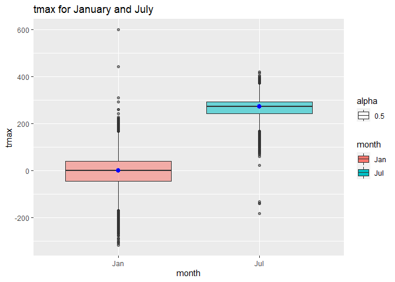
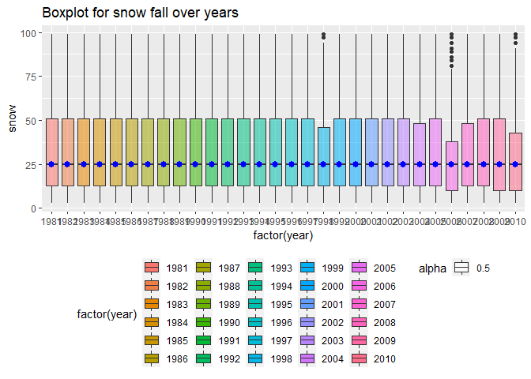

p8105_hw3_sx2337
================
Shun Xie
2022-10-06

Include all the packages and load options so that tibble data will only
print first five rows:

``` r
library('tidyverse')
```

    ## ── Attaching packages ─────────────────────────────────────── tidyverse 1.3.2 ──
    ## ✔ ggplot2 3.3.6      ✔ purrr   0.3.4 
    ## ✔ tibble  3.1.8      ✔ dplyr   1.0.10
    ## ✔ tidyr   1.2.0      ✔ stringr 1.4.1 
    ## ✔ readr   2.1.2      ✔ forcats 0.5.2 
    ## ── Conflicts ────────────────────────────────────────── tidyverse_conflicts() ──
    ## ✖ dplyr::filter() masks stats::filter()
    ## ✖ dplyr::lag()    masks stats::lag()

``` r
options(tibble.print_min = 5)
```

# Problem 2

I am given the five weeks of accelerometer data collected on a 63
year-old male with BMI 25. The data is loaded and cleaned name here:

``` r
acc_data = read_csv("data/accel_data.csv") %>% 
  janitor::clean_names()
```

    ## Rows: 35 Columns: 1443
    ## ── Column specification ────────────────────────────────────────────────────────
    ## Delimiter: ","
    ## chr    (1): day
    ## dbl (1442): week, day_id, activity.1, activity.2, activity.3, activity.4, ac...
    ## 
    ## ℹ Use `spec()` to retrieve the full column specification for this data.
    ## ℹ Specify the column types or set `show_col_types = FALSE` to quiet this message.

``` r
acc_data
```

    ## # A tibble: 35 × 1,443
    ##    week day_id day      activi…¹ activ…² activ…³ activ…⁴ activ…⁵ activ…⁶ activ…⁷
    ##   <dbl>  <dbl> <chr>       <dbl>   <dbl>   <dbl>   <dbl>   <dbl>   <dbl>   <dbl>
    ## 1     1      1 Friday       88.4    82.2    64.4    70.0    75.0    66.3    53.8
    ## 2     1      2 Monday        1       1       1       1       1       1       1  
    ## 3     1      3 Saturday      1       1       1       1       1       1       1  
    ## 4     1      4 Sunday        1       1       1       1       1       1       1  
    ## 5     1      5 Thursday     47.4    48.8    46.9    35.8    49.0    44.8    73.4
    ## # … with 30 more rows, 1,433 more variables: activity_8 <dbl>,
    ## #   activity_9 <dbl>, activity_10 <dbl>, activity_11 <dbl>, activity_12 <dbl>,
    ## #   activity_13 <dbl>, activity_14 <dbl>, activity_15 <dbl>, activity_16 <dbl>,
    ## #   activity_17 <dbl>, activity_18 <dbl>, activity_19 <dbl>, activity_20 <dbl>,
    ## #   activity_21 <dbl>, activity_22 <dbl>, activity_23 <dbl>, activity_24 <dbl>,
    ## #   activity_25 <dbl>, activity_26 <dbl>, activity_27 <dbl>, activity_28 <dbl>,
    ## #   activity_29 <dbl>, activity_30 <dbl>, activity_31 <dbl>, …

The data has week, day_id, day and 1440 activity with their respective
measured number. The data is too long to be read and therefore, I will
do the following procedure:

1.  privot long and create a column that store the activtity number and
    corresponding activity count.
2.  create a column specifying weekday or weekend.
3.  encode data with reasonable variable classes. Additionally, I factor
    the day variable so that day is leveled from Monday to Sunday in
    order.
4.  rearrange the order of columns and make week, day etc in the front
    and activity_minute and activity_count at the end.

``` r
acc_data_tidy = acc_data %>% 
  pivot_longer(
    activity_1:activity_1440,
    names_to = 'activity_minute',
    names_prefix = "activity_",
    values_to = 'activity_count'
  ) %>% 
  mutate(
    weekday_or_weekend = ifelse(day=='Saturday' | day=='Sunday', "weekend", "weekday")
    ) %>% 
  mutate(
    week = as.integer(week),
    day_id = as.integer(day_id),
    day = factor(day,levels= c("Monday", 
    "Tuesday", "Wednesday", "Thursday", "Friday", "Saturday","Sunday")),
    weekday_or_weekend = factor(weekday_or_weekend)
) %>% 
  select(week:day,weekday_or_weekend,everything())
acc_data_tidy
```

    ## # A tibble: 50,400 × 6
    ##    week day_id day    weekday_or_weekend activity_minute activity_count
    ##   <int>  <int> <fct>  <fct>              <chr>                    <dbl>
    ## 1     1      1 Friday weekday            1                         88.4
    ## 2     1      1 Friday weekday            2                         82.2
    ## 3     1      1 Friday weekday            3                         64.4
    ## 4     1      1 Friday weekday            4                         70.0
    ## 5     1      1 Friday weekday            5                         75.0
    ## # … with 50,395 more rows

The resulting data now has 6 variables, namely the week variable
specifying the week number, day_id variable specifying the id of the
day, day variable which measures the day is Monday to Sunday,
activity_minute variable measures for each minute of a 24-hour day
starting at midnight, activity_count measures the count of activity
during the one minute interval and weekday_or_weekend variable
specifying the day is weekday or weekend.

In the second part, I create a table that summarize the total activity
count of each day by following:

1.  using group_by to select the distint pairs of week and day variable
2.  summarize the sum respect to week and day
3.  create the table using pivot_wider

``` r
acc_data_tidy %>% 
  group_by(week,day) %>% 
  summarize(total_count = sum(activity_count)) %>% 
  pivot_wider(
    names_from = day,
    values_from = total_count
  )
```

    ## `summarise()` has grouped output by 'week'. You can override using the
    ## `.groups` argument.

    ## # A tibble: 5 × 8
    ## # Groups:   week [5]
    ##    week  Monday Tuesday Wednesday Thursday  Friday Saturday Sunday
    ##   <int>   <dbl>   <dbl>     <dbl>    <dbl>   <dbl>    <dbl>  <dbl>
    ## 1     1  78828. 307094.   340115.  355924. 480543.   376254 631105
    ## 2     2 295431  423245    440962   474048  568839    607175 422018
    ## 3     3 685910  381507    468869   371230  467420    382928 467052
    ## 4     4 409450  319568    434460   340291  154049      1440 260617
    ## 5     5 389080  367824    445366   549658  620860      1440 138421

There is no apparent obvious trend according to the table. It seems like
on last two weeks of Saturday, the old male does not do many activity
and activity count during weekdays are relatively stable.

In the last part, I will make ggplot on time courses for each day.

``` r
acc_data_tidy %>% 
  ggplot(aes(x=activity_minute,y=activity_count, color=day)) + geom_point() +geom_line()+theme(legend.position = "bottom")+
  labs(
    title = "Activity plot",
    x = "minute of the day",
    y = "activity count")+
  scale_x_discrete(
    breaks = seq(from = 0, to = 1440, by = 60), 
    labels = seq(from = 0, to = 1440, by = 60))
```

<!-- -->

The plotting as above. There is some up and down but on Sunday, the old
man is more active when it is close to 660 (around 11am) while during
week days, the old man is very active during the end of the day 1200
(around 8pm). Over all days, can see that the old man is inactive
between 1440 (12pm) and 540 (9am) and he is likely to be sleeping during
the time. He is more active during 1200 (around 8pm) and 660 (around
11am) according to the plot.

# Problem 3

First, load the data:

``` r
library(p8105.datasets)
data("ny_noaa")
ny_noaa
```

    ## # A tibble: 2,595,176 × 7
    ##   id          date        prcp  snow  snwd tmax  tmin 
    ##   <chr>       <date>     <int> <int> <int> <chr> <chr>
    ## 1 US1NYAB0001 2007-11-01    NA    NA    NA <NA>  <NA> 
    ## 2 US1NYAB0001 2007-11-02    NA    NA    NA <NA>  <NA> 
    ## 3 US1NYAB0001 2007-11-03    NA    NA    NA <NA>  <NA> 
    ## 4 US1NYAB0001 2007-11-04    NA    NA    NA <NA>  <NA> 
    ## 5 US1NYAB0001 2007-11-05    NA    NA    NA <NA>  <NA> 
    ## # … with 2,595,171 more rows

The data has `2595176` number of rows of data, ranging from 1981-01-01
to 2010-12-31. It contains 7 variables, namely weather station ID as id
variable, Data of observation stored in date variable, precipitation
measured in tenths of mm in prcp variable, snowfall in mm stored in snow
variable, the depth of snow in mm stored in snwd variable and tmax and
tmin variable measuring the maximum and minimum temperation, in tenths
of degrees C.

The structure of data is such: it contains all the information from each
weather station for each day and the date ranges from $1_{st}$ of
January 1981 to $31_{th}$ of December 2010. The data contains a lot of
missing values. Need following code to see the percentage of missing
value in the data:

``` r
no_missing_ny_noaa = na.omit(ny_noaa)
nrow(no_missing_ny_noaa)
```

    ## [1] 1222433

There are a total of `1372743` missing data, which is `47.10405`% of the
total observations. This is almost a half of all observations.
Therefore, missing data is an issue. But since the observation left is
`1222433`, which is huge. In consequence, remove the data will not have
a big problem as there is still enough data to make a conclusion.

First, clean the data: 1. seperate variables for year month and day 2.
make year month and day an integer value 3. make month into Jan, Feb,
etc 4. Precipitation and snowfall are in integer unit but temperature is
in character, so need to return into integers

``` r
ny_noaa_tidy = 
  ny_noaa %>% 
  separate(date,c('year','month','day'),sep='-') %>%
  mutate(
    year = as.integer(year),
    month = as.integer(month),
    day = as.integer(day)
  ) %>% 
  mutate(month = month.abb[month]) %>% 
  mutate(tmax = as.integer(tmax), tmin = as.integer(tmin))
ny_noaa_tidy
```

    ## # A tibble: 2,595,176 × 9
    ##   id           year month   day  prcp  snow  snwd  tmax  tmin
    ##   <chr>       <int> <chr> <int> <int> <int> <int> <int> <int>
    ## 1 US1NYAB0001  2007 Nov       1    NA    NA    NA    NA    NA
    ## 2 US1NYAB0001  2007 Nov       2    NA    NA    NA    NA    NA
    ## 3 US1NYAB0001  2007 Nov       3    NA    NA    NA    NA    NA
    ## 4 US1NYAB0001  2007 Nov       4    NA    NA    NA    NA    NA
    ## 5 US1NYAB0001  2007 Nov       5    NA    NA    NA    NA    NA
    ## # … with 2,595,171 more rows

``` r
#create a function to obtain mode
modefunct <- function(val){
  # get the unique value
  uniqueval <- unique(val)
  # match the number of value using tabulate and find the value with maximum count using which.max
  uniqueval[which.max(tabulate(match(val, uniqueval)))]
}
modefunct(na.omit(ny_noaa_tidy$snow))
```

    ## [1] 0

The most common value is `0`. This means that in most of the day and
most of the weather station, there is no snowfall. This is because most
of the place only snow in winter and some of the places even do not snow
for the whole year. Therefore, 0 is the most common number for snowfall.

In the second part, I make a two-panel box plot which can be used to
show the average max temperature in January and in July in each station
across years.

``` r
ny_noaa_tidy %>% 
  filter(month=='Jan'|month=='Jul') %>% 
  ggplot(aes(x = month, y = tmax)) + geom_boxplot(aes(fill = month,alpha=.5))+stat_summary(fun = "median", color = "blue")+
  labs(title = "tmax for January and July")
```

    ## Warning: Removed 190331 rows containing non-finite values (stat_boxplot).

    ## Warning: Removed 190331 rows containing non-finite values (stat_summary).

    ## Warning: Removed 2 rows containing missing values (geom_segment).

<!-- -->
According to the boxplot, the median for maximum temperature in January
is approximately 0 in tenth degree C, whereas the median value for
maximum temperature in July is approximately 270. Hence July has a
median higher than the maximum temperature in January. However, can be
seen in the blox plot, there are many outliers in the boxplot for
January than the one in July. More importantly, the maximum temperature
in January is more spread out than the one in July, as indicated by the
thicker interquartile range and a greater range of values. The maximum
outlier for January can be as high as 600 tenth of degree C, which is
higher than the maximum temperature outlier for July, and as cold as
-300 tenth of degree C, which is lower than the minimum temperature in
July.

In the last part, I will first make a boxplot for tmax vs tmin for the
full dataset by first merge the tmax and tmin together into a
temperature value using pivot longer and plot boxplot using ggplot:

``` r
ny_noaa_tidy %>% 
  pivot_longer(
    c(tmin,tmax),
    names_to = "temperature_type",
    values_to = "tval"
  ) %>% 
  ggplot(aes(x=temperature_type,y=tval))+ geom_boxplot(aes(fill = temperature_type,alpha=.5))+stat_summary(fun = "median", color = "blue")+
  labs(title = "Boxplot for tmax and tmin")
```

    ## Warning: Removed 2268778 rows containing non-finite values (stat_boxplot).

    ## Warning: Removed 2268778 rows containing non-finite values (stat_summary).

    ## Warning: Removed 2 rows containing missing values (geom_segment).

<!-- -->

Can be seen from the boxplot, tmax has a median of approximately 150
whereas tmin has a median of around 30. tmin also has a wider range than
tmax.

Then I make a box plot showing the distribution of snowfall values
greater than 0 and less than 100 separately by year.

``` r
ny_noaa_tidy %>% 
  filter(snow>0 & snow<100) %>% 
  ggplot(aes(x=factor(year),y=snow))+ geom_boxplot(aes(fill = factor(year),alpha=.5))+stat_summary(fun = "median", color = "blue")+
  labs(title = "Boxplot for snow fall over years")+theme(legend.position = "bottom")
```

    ## Warning: Removed 30 rows containing missing values (geom_segment).

<!-- -->

Can be seen by the boxplots, over the 30 years the median of snowfall is
persistently around 25mm. In the year from 1981 to 1997, the
interquartile range are almost the same. Only when it comes to year 2006
the box plot has a lower quartile than other years with a few outliers
ranging from 75mm to 100mm.
