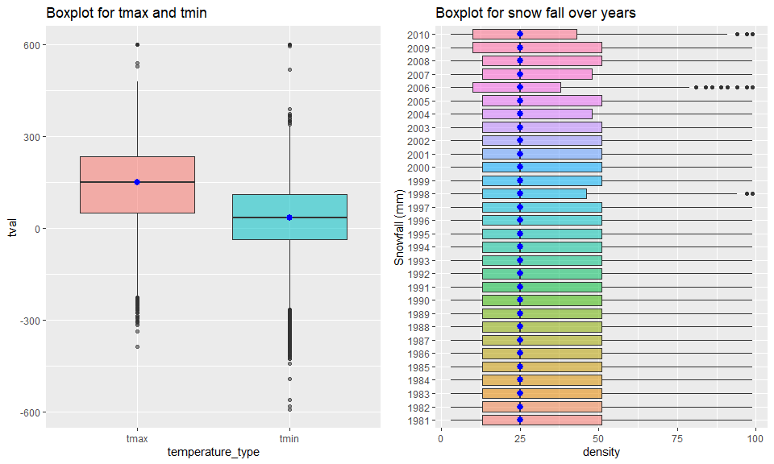

p8105_hw3_sx2337
================
Shun Xie
2022-10-06

Include all the packages and load options so that tibble data will only
print first five rows:

``` r
library('tidyverse')
```

    ## ── Attaching packages ─────────────────────────────────────── tidyverse 1.3.2 ──
    ## ✔ ggplot2 3.3.6      ✔ purrr   0.3.4 
    ## ✔ tibble  3.1.8      ✔ dplyr   1.0.10
    ## ✔ tidyr   1.2.0      ✔ stringr 1.4.1 
    ## ✔ readr   2.1.2      ✔ forcats 0.5.2 
    ## ── Conflicts ────────────────────────────────────────── tidyverse_conflicts() ──
    ## ✖ dplyr::filter() masks stats::filter()
    ## ✖ dplyr::lag()    masks stats::lag()

``` r
options(tibble.print_min = 5)
```

# Problem 1

``` r
library(p8105.datasets)
data("instacart")
instacart
```

    ## # A tibble: 1,384,617 × 15
    ##   order_id product_id add_to_c…¹ reord…² user_id eval_…³ order…⁴ order…⁵ order…⁶
    ##      <int>      <int>      <int>   <int>   <int> <chr>     <int>   <int>   <int>
    ## 1        1      49302          1       1  112108 train         4       4      10
    ## 2        1      11109          2       1  112108 train         4       4      10
    ## 3        1      10246          3       0  112108 train         4       4      10
    ## 4        1      49683          4       0  112108 train         4       4      10
    ## 5        1      43633          5       1  112108 train         4       4      10
    ## # … with 1,384,612 more rows, 6 more variables: days_since_prior_order <int>,
    ## #   product_name <chr>, aisle_id <int>, department_id <int>, aisle <chr>,
    ## #   department <chr>, and abbreviated variable names ¹​add_to_cart_order,
    ## #   ²​reordered, ³​eval_set, ⁴​order_number, ⁵​order_dow, ⁶​order_hour_of_day

There are `1384617` number of samples measuring the number of orders and
product being purchased in each cart. Each product has its aisle and
department

Q1:

``` r
instacart %>% 
  distinct(aisle) %>% 
  nrow()
```

    ## [1] 134

``` r
instacart %>% 
  group_by(aisle) %>% 
  distinct() %>% 
  summarize(num=n()) %>% 
  arrange(desc(num))
```

    ## # A tibble: 134 × 2
    ##   aisle                         num
    ##   <chr>                       <int>
    ## 1 fresh vegetables           150609
    ## 2 fresh fruits               150473
    ## 3 packaged vegetables fruits  78493
    ## 4 yogurt                      55240
    ## 5 packaged cheese             41699
    ## # … with 129 more rows

Fresh vegetables has the most item order.

Q2

``` r
instacart %>% 
  group_by(aisle) %>% 
  distinct() %>% 
  mutate(num=n()) %>% 
  ungroup %>% 
  filter(num>10000) %>% 
  mutate(aisle = fct_reorder(aisle,num)) %>% 
  ggplot(aes(x = aisle,y=num))+geom_bar(stat="identity")+coord_flip()+labs(
    title = "number of order in each aisle")
```

<!-- -->

Q3

``` r
instacart %>% 
  filter(aisle=="baking ingredients"|
           aisle=="dog food care" |
           aisle=="packaged vegetables fruits") %>% 
  group_by(aisle, product_name) %>% 
  summarize(num=n()) %>% 
  ungroup() %>% 
  arrange(desc(num)) %>% 
  group_by(aisle) %>% 
  slice(1:3) 
```

    ## `summarise()` has grouped output by 'aisle'. You can override using the
    ## `.groups` argument.

    ## # A tibble: 9 × 3
    ## # Groups:   aisle [3]
    ##   aisle                      product_name                                    num
    ##   <chr>                      <chr>                                         <int>
    ## 1 baking ingredients         Light Brown Sugar                               499
    ## 2 baking ingredients         Pure Baking Soda                                387
    ## 3 baking ingredients         Cane Sugar                                      336
    ## 4 dog food care              Snack Sticks Chicken & Rice Recipe Dog Treats    30
    ## 5 dog food care              Organix Chicken & Brown Rice Recipe              28
    ## 6 dog food care              Small Dog Biscuits                               26
    ## 7 packaged vegetables fruits Organic Baby Spinach                           9784
    ## 8 packaged vegetables fruits Organic Raspberries                            5546
    ## 9 packaged vegetables fruits Organic Blueberries                            4966

Q4:

``` r
instacart %>% 
  filter(product_name=="Pink Lady Apples" | product_name == "Coffee Ice Cream") %>% 
  group_by(product_name,order_dow) %>% 
  summarize(mean_hour = mean(order_hour_of_day)) %>% 
  pivot_wider(
    names_from = order_dow,
    values_from = mean_hour
  )
```

    ## `summarise()` has grouped output by 'product_name'. You can override using the
    ## `.groups` argument.

    ## # A tibble: 2 × 8
    ## # Groups:   product_name [2]
    ##   product_name       `0`   `1`   `2`   `3`   `4`   `5`   `6`
    ##   <chr>            <dbl> <dbl> <dbl> <dbl> <dbl> <dbl> <dbl>
    ## 1 Coffee Ice Cream  13.8  14.3  15.4  15.3  15.2  12.3  13.8
    ## 2 Pink Lady Apples  13.4  11.4  11.7  14.2  11.6  12.8  11.9

# Problem 2

I am given the five weeks of accelerometer data collected on a 63
year-old male with BMI 25. The data is loaded and cleaned name here:

``` r
acc_data = read_csv("data/accel_data.csv") %>% 
  janitor::clean_names()
```

    ## Rows: 35 Columns: 1443
    ## ── Column specification ────────────────────────────────────────────────────────
    ## Delimiter: ","
    ## chr    (1): day
    ## dbl (1442): week, day_id, activity.1, activity.2, activity.3, activity.4, ac...
    ## 
    ## ℹ Use `spec()` to retrieve the full column specification for this data.
    ## ℹ Specify the column types or set `show_col_types = FALSE` to quiet this message.

``` r
acc_data
```

    ## # A tibble: 35 × 1,443
    ##    week day_id day      activi…¹ activ…² activ…³ activ…⁴ activ…⁵ activ…⁶ activ…⁷
    ##   <dbl>  <dbl> <chr>       <dbl>   <dbl>   <dbl>   <dbl>   <dbl>   <dbl>   <dbl>
    ## 1     1      1 Friday       88.4    82.2    64.4    70.0    75.0    66.3    53.8
    ## 2     1      2 Monday        1       1       1       1       1       1       1  
    ## 3     1      3 Saturday      1       1       1       1       1       1       1  
    ## 4     1      4 Sunday        1       1       1       1       1       1       1  
    ## 5     1      5 Thursday     47.4    48.8    46.9    35.8    49.0    44.8    73.4
    ## # … with 30 more rows, 1,433 more variables: activity_8 <dbl>,
    ## #   activity_9 <dbl>, activity_10 <dbl>, activity_11 <dbl>, activity_12 <dbl>,
    ## #   activity_13 <dbl>, activity_14 <dbl>, activity_15 <dbl>, activity_16 <dbl>,
    ## #   activity_17 <dbl>, activity_18 <dbl>, activity_19 <dbl>, activity_20 <dbl>,
    ## #   activity_21 <dbl>, activity_22 <dbl>, activity_23 <dbl>, activity_24 <dbl>,
    ## #   activity_25 <dbl>, activity_26 <dbl>, activity_27 <dbl>, activity_28 <dbl>,
    ## #   activity_29 <dbl>, activity_30 <dbl>, activity_31 <dbl>, …

The data has week, day_id, day and 1440 activity with their respective
measured number. The data is too long to be read and therefore, I will
do the following procedure:

1.  privot long and create a column that store the activtity number and
    corresponding activity count.
2.  create a column specifying weekday or weekend.
3.  encode data with reasonable variable classes. Additionally, I factor
    the day variable so that day is leveled from Monday to Sunday in
    order.
4.  rearrange the order of columns and make week, day etc in the front
    and activity_minute and activity_count at the end.

``` r
acc_data_tidy = acc_data %>% 
  pivot_longer(
    activity_1:activity_1440,
    names_to = 'activity_minute',
    names_prefix = "activity_",
    values_to = 'activity_count'
  ) %>% 
  mutate(
    weekday_or_weekend = ifelse(day=='Saturday' | day=='Sunday', "weekend", "weekday")
    ) %>% 
  mutate(
    week = as.integer(week),
    activity_minute = as.numeric(activity_minute),
    day_id = as.integer(day_id),
    day = factor(day,levels= c("Monday", 
    "Tuesday", "Wednesday", "Thursday", "Friday", "Saturday","Sunday")),
    weekday_or_weekend = factor(weekday_or_weekend)
) %>% 
  select(week:day,weekday_or_weekend,everything())
acc_data_tidy
```

    ## # A tibble: 50,400 × 6
    ##    week day_id day    weekday_or_weekend activity_minute activity_count
    ##   <int>  <int> <fct>  <fct>                        <dbl>          <dbl>
    ## 1     1      1 Friday weekday                          1           88.4
    ## 2     1      1 Friday weekday                          2           82.2
    ## 3     1      1 Friday weekday                          3           64.4
    ## 4     1      1 Friday weekday                          4           70.0
    ## 5     1      1 Friday weekday                          5           75.0
    ## # … with 50,395 more rows

The resulting data now has 6 variables, namely the week variable
specifying the week number, day_id variable specifying the id of the
day, day variable which measures the day from Monday to Sunday,
activity_minute variable measures the minute when the activity count was
collected from the start of the day to midnight, activity_count measures
the count of activity during the one minute interval and
weekday_or_weekend variable specifying the day is weekday or weekend.

In the second part, I create a table that summarize the total activity
count of each day by following:

1.  using group_by to select the distint pairs of week and day variable
2.  summarize the sum respect to week and day
3.  create the table using pivot_wider

``` r
acc_data_tidy %>% 
  group_by(week,day) %>% 
  summarize(total_count = sum(activity_count)) %>% 
  pivot_wider(
    names_from = day,
    values_from = total_count
  ) %>% 
  knitr::kable()
```

    ## `summarise()` has grouped output by 'week'. You can override using the
    ## `.groups` argument.

| week |    Monday |  Tuesday | Wednesday | Thursday |   Friday | Saturday | Sunday |
|-----:|----------:|---------:|----------:|---------:|---------:|---------:|-------:|
|    1 |  78828.07 | 307094.2 |    340115 | 355923.6 | 480542.6 |   376254 | 631105 |
|    2 | 295431.00 | 423245.0 |    440962 | 474048.0 | 568839.0 |   607175 | 422018 |
|    3 | 685910.00 | 381507.0 |    468869 | 371230.0 | 467420.0 |   382928 | 467052 |
|    4 | 409450.00 | 319568.0 |    434460 | 340291.0 | 154049.0 |     1440 | 260617 |
|    5 | 389080.00 | 367824.0 |    445366 | 549658.0 | 620860.0 |     1440 | 138421 |

There is no apparent obvious trend according to the table. It seems like
on last two weeks of Saturday, the old male does not do many activity
and activity count during weekdays are relatively stable.

In the last part, I will make ggplot on time courses for each day.

``` r
acc_data_tidy %>% 
  ggplot(aes(x=activity_minute,y=activity_count, color=day)) + geom_point() +geom_line()+theme(legend.position = "bottom")+
  labs(
    title = "Activity plot",
    x = "minute of the day",
    y = "activity count")+
  scale_x_continuous(
    breaks = c(0,180,360,540,720,900,1080,1260,1440),
    labels = c("12AM","3AM","6AM","9AM","12PM","3PM","6PM","9PM","12AM"),
    limits = c(0,1440))
```

<!-- -->

The plotting as above. There is some up and down but on Sunday, the old
man is more active when it is close to 12PM while during week days, the
old man is very active during the end of the day around 8pm. Over all
days, can see that the old man is inactive between 12PM and 9AM and he
is likely to be sleeping during the time. He is more active during 8PM
and 11AM according to the plot.

# Problem 3

First, load the data:

``` r
library(p8105.datasets)
data("ny_noaa")
ny_noaa
```

    ## # A tibble: 2,595,176 × 7
    ##   id          date        prcp  snow  snwd tmax  tmin 
    ##   <chr>       <date>     <int> <int> <int> <chr> <chr>
    ## 1 US1NYAB0001 2007-11-01    NA    NA    NA <NA>  <NA> 
    ## 2 US1NYAB0001 2007-11-02    NA    NA    NA <NA>  <NA> 
    ## 3 US1NYAB0001 2007-11-03    NA    NA    NA <NA>  <NA> 
    ## 4 US1NYAB0001 2007-11-04    NA    NA    NA <NA>  <NA> 
    ## 5 US1NYAB0001 2007-11-05    NA    NA    NA <NA>  <NA> 
    ## # … with 2,595,171 more rows

The data has `2595176` number of rows of data, ranging from 1981-01-01
to 2010-12-31. It contains 7 variables, namely weather station ID as id
variable, Data of observation stored in date variable, precipitation
measured in tenths of mm in prcp variable, snowfall in mm stored in snow
variable, the depth of snow in mm stored in snwd variable and tmax and
tmin variable measuring the maximum and minimum temperation, in tenths
of degrees C.

The structure of data is such: it contains all the information from each
weather station for each day and the date ranges from $1_{st}$ of
January 1981 to $31_{th}$ of December 2010. The data contains a lot of
missing values. Need following code to see the percentage of missing
value in the data:

``` r
no_missing_ny_noaa = na.omit(ny_noaa)
nrow(no_missing_ny_noaa)
```

    ## [1] 1222433

There are a total of `1372743` rows that contains missing data, which is
`47.10405`% of the total observations. This is almost a half of all
observations. Therefore, missing data is an issue. But since the
observation left is `1222433`, which is huge. In consequence, remove the
data will not have a big problem as there is still enough data to make a
conclusion.

First, clean the data: 1. seperate variables for year month and day 2.
make year month and day an integer value 3. make month into Jan, Feb,
etc 4. Precipitation and snowfall are in integer unit but temperature is
in character, so need to return into integers

``` r
ny_noaa_tidy = 
  ny_noaa %>% 
  separate(date,c('year','month','day'),sep='-') %>%
  mutate(
    year = as.integer(year),
    month = as.integer(month),
    day = as.integer(day)
  ) %>% 
  mutate(month = month.abb[month]) %>% 
  mutate(tmax = as.integer(tmax), tmin = as.integer(tmin))
ny_noaa_tidy
```

    ## # A tibble: 2,595,176 × 9
    ##   id           year month   day  prcp  snow  snwd  tmax  tmin
    ##   <chr>       <int> <chr> <int> <int> <int> <int> <int> <int>
    ## 1 US1NYAB0001  2007 Nov       1    NA    NA    NA    NA    NA
    ## 2 US1NYAB0001  2007 Nov       2    NA    NA    NA    NA    NA
    ## 3 US1NYAB0001  2007 Nov       3    NA    NA    NA    NA    NA
    ## 4 US1NYAB0001  2007 Nov       4    NA    NA    NA    NA    NA
    ## 5 US1NYAB0001  2007 Nov       5    NA    NA    NA    NA    NA
    ## # … with 2,595,171 more rows

In order to find the mode of value for snow fall, it is possible to
count the value.

``` r
ny_noaa_tidy %>%
  na.omit() %>% 
  count(snow) %>%
  arrange(desc(n))
```

    ## # A tibble: 248 × 2
    ##    snow       n
    ##   <int>   <int>
    ## 1     0 1112758
    ## 2    25   15809
    ## 3    13   12460
    ## 4    51    9252
    ## 5     5    5669
    ## # … with 243 more rows

Or find mode n by function:

``` r
#create a function to obtain mode
modefunct <- function(val){
  # get the unique value
  uniqueval <- unique(val)
  # match the number of value using tabulate and find the value with maximum count using which.max
  uniqueval[which.max(tabulate(match(val, uniqueval)))]
}
modefunct(na.omit(ny_noaa_tidy$snow))
```

    ## [1] 0

The most common value is `0`. This means that in most of the day and
most of the weather station, there is no snowfall. This is because most
of the place only snow in winter and some of the places even do not snow
for the whole year. Therefore, 0 is the most common number for snowfall.

In the second part, I make a two-panel box plot which can be used to
show the average max temperature in January and in July in each station
across years.

``` r
ny_noaa_tidy %>% 
  filter(month=='Jan'|month=='Jul') %>% 
  ggplot(aes(x = month, y = tmax)) + geom_boxplot(aes(fill = month,alpha=.5))+stat_summary(fun = "median", color = "blue")+
  labs(title = "tmax for January and July")
```

<!-- --> On
the other hand, I also plot a mean temperature for all year for
corresponding mean temperature of the weather station in Januaray and
July respectively along the graph. Here is the plotting:

``` r
ny_noaa_tidy %>% 
  group_by(id, year, month) %>%
  filter(month=='Jan'|month=='Jul') %>% 
  summarize(mean_val_tmax = mean(tmax,na.rm=TRUE)) %>% 
  ungroup() %>% 
  ggplot(aes(x=year, y=mean_val_tmax, color = month))+
  geom_point(alpha=.1)+
  geom_smooth(alpha=.5)+
  labs(
    title = "Average tmax for all station across years in January and July",
    x = "year",
    y = "temperatue"
    )+
  scale_x_continuous(breaks = seq(1980,2010,5))+
  facet_grid(. ~ month) +
  scale_color_manual(values = c("blue", "orange"))
```

    ## `summarise()` has grouped output by 'id', 'year'. You can override using the
    ## `.groups` argument.
    ## `geom_smooth()` using method = 'gam' and formula 'y ~ s(x, bs = "cs")'

<!-- -->

According to the boxplot and the plot over all years, the median for
maximum temperature in January is approximately 0 in tenth degree C,
whereas the median value for maximum temperature in July is
approximately 270. Hence July has a median higher than the maximum
temperature in January. However, can be seen in the blox plot, there are
many outliers in the boxplot for January than the one in July. More
importantly, the maximum temperature in January is more spread out than
the one in July, as indicated by the thicker interquartile range and a
greater range of values. The maximum outlier for January can be as high
as 600 tenth of degree C, which is higher than the maximum temperature
outlier for July, and as cold as -300 tenth of degree C, which is lower
than the minimum temperature in July.

In terms of the plot for average tmax over all years, the range of mean
temperature over all year in January also have a greater range than the
mean temperature in July. The fluctuation over all year also suggest
that temperature in July is more stable than the one in January.

In the last part, I will first make a boxplot for tmax vs tmin for the
full dataset by first merge the tmax and tmin together into a
temperature value using pivot longer and plot boxplot using ggplot.

``` r
ny_boxplot_tmax_vs_tmin = 
ny_noaa_tidy %>% 
  pivot_longer(
    c(tmin,tmax),
    names_to = "temperature_type",
    values_to = "tval"
  ) %>% 
  ggplot(aes(x=temperature_type,y=tval))+ geom_boxplot(aes(fill = temperature_type,alpha=.5))+stat_summary(fun = "median", color = "blue")+
  labs(title = "Boxplot for tmax and tmin")+theme(legend.position = "none")
```

Then I make a box plot showing the distribution of snowfall values
greater than 0 and less than 100 separately by year.

``` r
ny_noaa_distrioveryear = ny_noaa_tidy %>% 
  filter(snow>0 & snow<100) %>% 
  ggplot(aes(x=factor(year),y=snow))+ geom_boxplot(aes(fill = factor(year),alpha=.5))+stat_summary(fun = "median", color = "blue")+
  labs(title = "Boxplot for snow fall over years",
       x = "Snowfall (mm)",
        y = "density")+
  coord_flip()+theme(legend.position = "none")
```

Here is the two panel plot of the above two graph:

``` r
library(gridExtra)
```

    ## 
    ## 载入程辑包：'gridExtra'

    ## The following object is masked from 'package:dplyr':
    ## 
    ##     combine

``` r
grid.arrange(ny_boxplot_tmax_vs_tmin, ny_noaa_distrioveryear, ncol=2)
```

<!-- -->

Can be seen from the boxplot on the left hand side, tmax has a median of
approximately 150 whereas tmin has a median of around 30. tmin also has
a wider range than tmax.

Can be seen by the boxplots on the right hand side, over the 30 years
the median of snowfall is persistently around 25mm. In the year from
1981 to 1997, the interquartile range are almost the same. Only when it
comes to year 2006 the box plot has a lower quartile than other years
with a few outliers ranging from 75mm to 100mm.

On the other hand, I create a two-panel plot for tmax against tmin on
left hand side using hexagon plot and on the right hand side, I plot the
density plot of all years:

``` r
library(ggridges)

ny_hexagon = 
  ny_noaa_tidy %>% 
  ggplot(aes(x = tmin, y = tmax)) + 
  geom_hex() +
  labs(title = "Hexagon plot for max vs min temperature",
       x = "tmin",
       y = "tmax")+theme(legend.position = "right")
  

density_for_all_year = 
  ny_noaa_tidy %>% 
  filter(snow>0 & snow<100) %>% 
  ggplot(aes(x = snow, y = year,group = year)) + 
  geom_density_ridges(scale = .85)+
  scale_x_continuous(
      breaks = seq(0,100,10)) +
    scale_y_continuous(
      breaks = seq(1980,2010,5))+
  labs(title="Desnity for all snowfall over years",
       x = "snowfall",
       y = "year")

grid.arrange(ny_hexagon, density_for_all_year, ncol=2)
```

    ## Picking joint bandwidth of 3.76

<!-- -->
